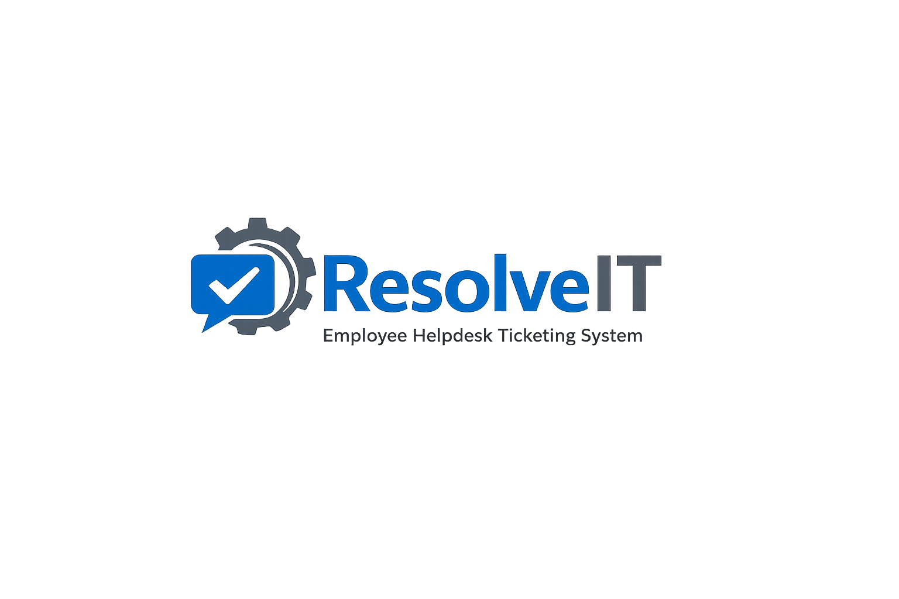

# 🚀 ResolveIT — Employee Helpdesk Ticketing System

<p align="center">
  
</p>

<p align="center">
  <b>A modern, secure, and production-style IT Helpdesk Ticketing Platform built using Flask.</b>
</p>

<p align="center">
  Streamlining internal IT support workflows with intelligent ticket management, role-based access control, and a clean enterprise-grade interface.
</p>

---

# ✨ Overview

ResolveIT is a professional Employee Helpdesk Ticketing System designed to simulate real-world IT support operations inside organizations.

The platform allows employees to raise and track technical support requests while enabling IT administrators to efficiently manage tickets, monitor workflows, update statuses, and handle issue resolution through a centralized dashboard.

Built with scalability, security, and user experience in mind, ResolveIT follows a modular Flask architecture and modern UI principles suitable for portfolio, academic, and production-level demonstrations.

---

# 🔥 Key Features

## 👨‍💼 Employee Features

* Secure User Registration & Login
* Create IT Support Tickets
* Track Ticket Status in Real-Time
* Upload Evidence Files (Optional)
* View Ticket History
* Responsive User Dashboard

---

## 🛠️ Admin Features

* Dedicated Admin Dashboard
* View & Manage All Tickets
* Update Ticket Status
* Assign Ticket Priority
* Add Administrative Remarks
* Search & Filter Tickets
* Dashboard Analytics & Statistics
* Ticket Pulse Scoring System

---

## 🔐 Security Features

* Password Hashing using Werkzeug
* CSRF Protection
* Secure Session Management
* Form Validation
* Duplicate Email Prevention
* Role-Based Access Control
* Protected Admin Routes

---

# 🧠 Ticket Workflow

```text
Open → In Progress → Resolved → Closed
```

---

# ⚡ Tech Stack

| Technology  | Purpose           |
| ----------- | ----------------- |
| Flask       | Backend Framework |
| SQLite      | Database          |
| SQLAlchemy  | ORM               |
| Flask-Login | Authentication    |
| Flask-WTF   | Form Handling     |
| Bootstrap 5 | Responsive UI     |
| HTML5/CSS3  | Frontend          |
| Werkzeug    | Password Security |

---

# 📸 Application Screenshots

## 🔑 Login Page

> Add screenshot here

```text
screenshots/login.png
```

---

## 📊 Admin Dashboard

> Add screenshot here

```text
screenshots/dashboard.png
```

---

## 🎫 Ticket Management

> Add screenshot here

```text
screenshots/tickets.png
```

---

# 📂 Project Structure

```text
employee-helpdesk-system/
│
├── app.py
├── config.py
├── requirements.txt
├── README.md
│
├── static/
│   ├── css/
│   ├── js/
│   ├── img/
│   └── uploads/
│
├── templates/
│
├── models/
│
├── forms/
│
├── routes/
│
└── database/
```

---

# ⚙️ Installation Guide

## 1️⃣ Clone Repository

```bash
git clone https://github.com/HB2810/ResolveIT--Employee-Helpdesk-Ticketing-System.git
```

---

## 2️⃣ Navigate to Project Folder

```bash
cd ResolveIT--Employee-Helpdesk-Ticketing-System
```

---

## 3️⃣ Create Virtual Environment

```bash
python -m venv venv
```

### Windows

```bash
venv\Scripts\activate
```

---

## 4️⃣ Install Dependencies

```bash
pip install -r requirements.txt
```

---

## 5️⃣ Run Application

```bash
python app.py
```

---

## 6️⃣ Open in Browser

```text
http://127.0.0.1:5000
```

---

# 🗄️ Database Initialization

The application automatically initializes the SQLite database during startup.

Generated database:

```text
database/helpdesk.db
```

All required tables are created automatically if they do not already exist.

---

# 👑 Default Admin Credentials

```text
Email: admin@example.com
Password: Admin@123
```

> Change admin credentials immediately in production environments.

---

# 🎯 Why ResolveIT?

✔️ Real-world IT support workflow simulation
✔️ Clean modular Flask architecture
✔️ Professional dashboard system
✔️ Resume-ready enterprise project
✔️ Production-style authentication system
✔️ Practical implementation of IT operations concepts

---

# 🚀 Future Enhancements

* OTP Email Verification
* Email Notification System
* PostgreSQL Migration
* Dark Mode UI
* REST API Integration
* Live Chat Support
* AI-Based Ticket Prioritization
* Audit Logs & Activity Tracking
* Advanced Analytics Dashboard
* Docker Deployment

---

# 📌 Deployment Roadmap

* GitHub Repository Hosting
* Render Cloud Deployment
* Supabase PostgreSQL Integration
* Environment Variable Security
* Production WSGI Configuration

---

# 👨‍💻 Developer

## Het Bhatt

 B.E. Information Technology
Passionate about AI, IT Infrastructure, Automation, and Intelligent Systems


---

# ⭐ Support

If you found this project useful, consider starring the repository to support development and future improvements.
